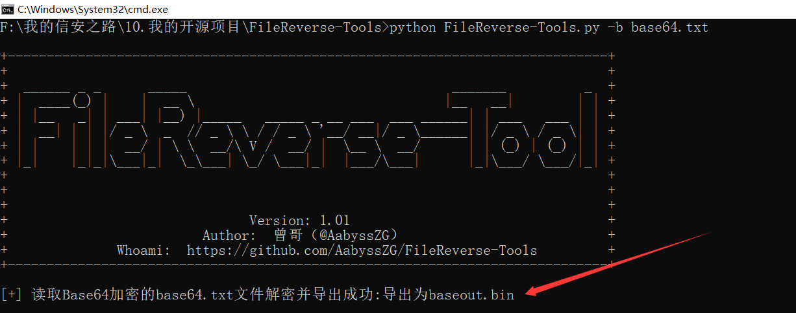
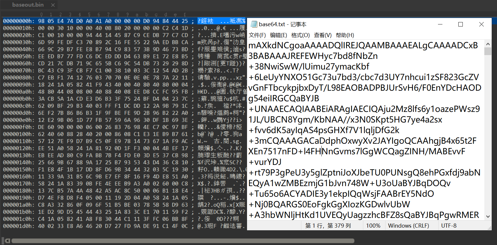
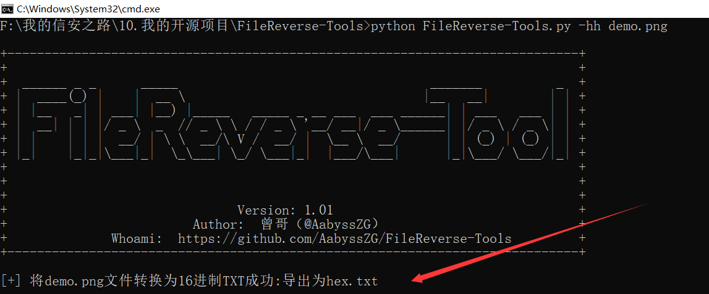
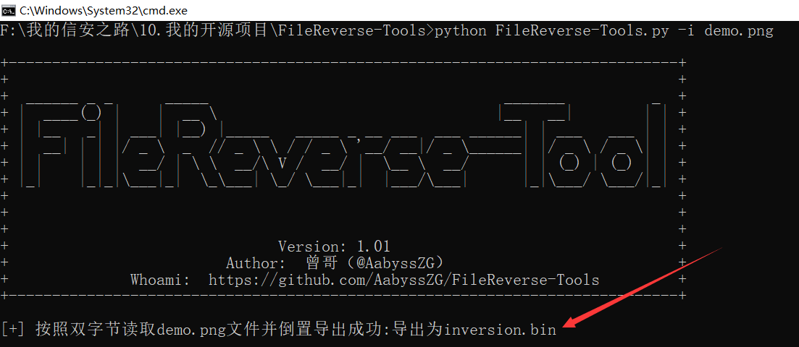
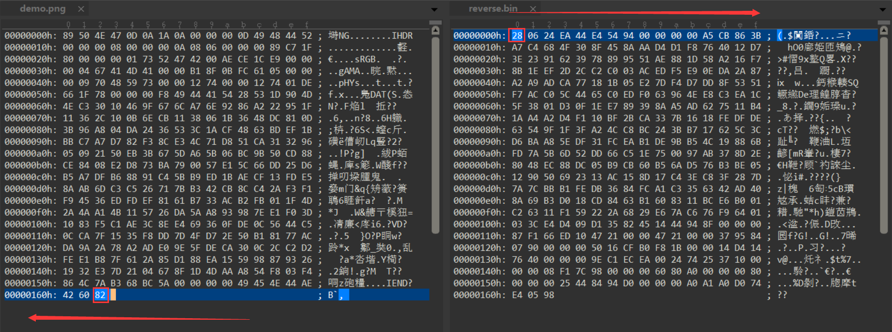
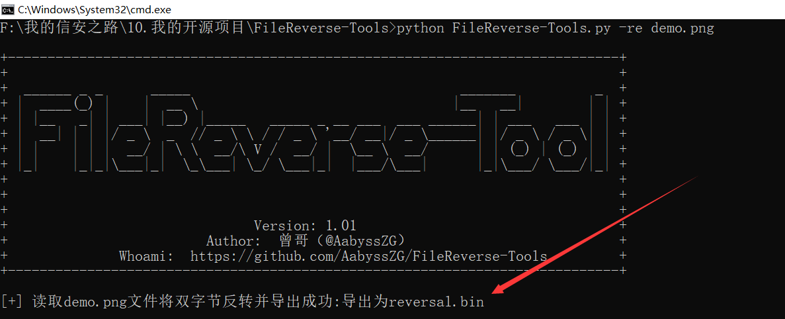
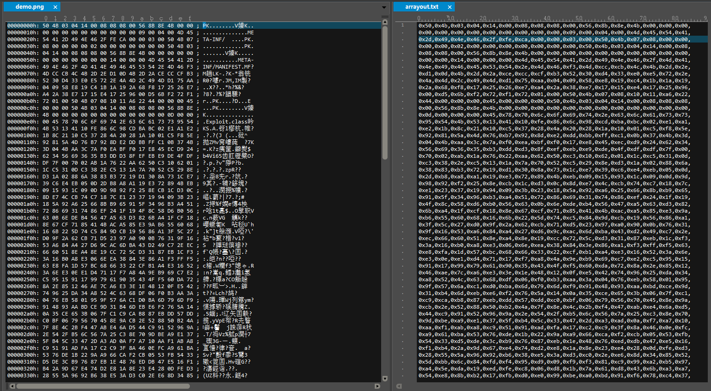

# FileReverse-Tools

对二进制文件反转、倒置相关的工具，解决CTF和生活中的文件处理问题

**我发现网上关于这种文件反转、倒置的工具和脚本比较少，那就自己造一个哈哈~欢迎各位师傅点个Star！！！**

本项目的特点：
- 适配性高，能方便运行于Python3环境
- 操作简单，适合CTFer上手，对MISC中畸形文件的处理更加得心应手
- 傻瓜式操作，只需将需要处理的文件放入脚本目录即可

# 工具使用

```
+-----------------------------------------------------------------------------+
+                                                                             +
+  ______ _ _      _____                                  _______          _  +
+ |  ____(_) |    |  __ \                                |__   __|        | | +
+ | |__   _| | ___| |__) |_____   _____ _ __ ___  ___ ______| | ___   ___ | | +
+ |  __| | | |/ _ \  _  // _ \ \ / / _ \ '__/ __|/ _ \______| |/ _ \ / _ \| | +
+ | |    | | |  __/ | \ \  __/\ V /  __/ |  \__ \  __/      | | (_) | (_) | | +
+ |_|    |_|_|\___|_|  \_\___| \_/ \___|_|  |___/\___|      |_|\___/ \___/|_| +
+                                                                             +
+                                                                             +
+                               Version: 1.03                                 +
+                         Author:  曾哥（@AabyssZG）                          +
+              Whoami:  https://github.com/AabyssZG/FileReverse-Tools         +
+-----------------------------------------------------------------------------+


用法:
        读取Base64的TXT文件解密并导出为文件:   python3 FileReverse-Tools.py -b base64.txt
        读取文件导出为十六进制TXT:        python3 FileReverse-Tools.py -hh bin
        读取十六进制TXT导出为文件:        python3 FileReverse-Tools.py -uh hex.txt
        按照双字节读取文件并倒置导出:       python3 FileReverse-Tools.py -i bin
        读取文件十六进制并倒置导出:    python3 FileReverse-Tools.py -r bin
        读取文件将双字节反转并导出:    python3 FileReverse-Tools.py -re bin
参数:
        -b  --baseout   读取Base64的TXT文件解密并导出为文件
        -hh --hhex      读取文件导出为16进制TXT
        -uh --unhex     读取16进制TXT导出为文件
        -i  --inversion 按照双字节读取文件并倒置导出
        -r  --reverse   读取文件十六进制并倒置导出
        -re --reversal  读取文件将双字节反转并导出
        -a  --arrayout  读取文件导出为16进制数组TXT
```

# 工具演示

### 读取Base64的TXT文件解密并导出为文件

```
python3 FileReverse-Tools.py -b base64.txt
```





### 读取文件导出为16进制TXT

```
python3 FileReverse-Tools.py -hh demo.png
```




**读取十六进制TXT导出为文件，即反向操作，就不展示了**

### 按照双字节读取文件并倒置导出

```
python3 FileReverse-Tools.py -i demo.png
```




### 读取文件十六进制并倒置导出

```
python3 FileReverse-Tools.py -r demo.png
```




### 读取文件将双字节反转并导出

```
python3 FileReverse-Tools.py -re demo.png
```




### 读取文件导出为16进制数组TXT

```
python3 FileReverse-Tools.py -a demo.png
```




## 项目 Star 数量统计趋势图

[](https://star-history.com/#AabyssZG/FileReverse-Tools&Date)
